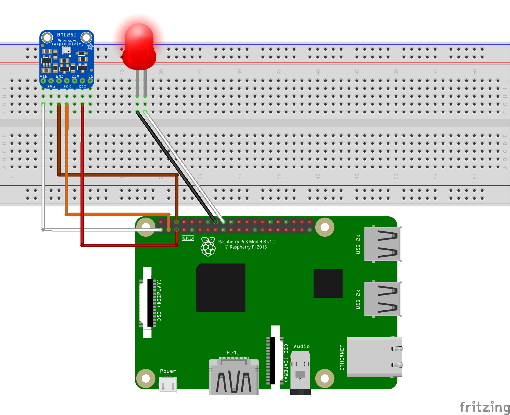
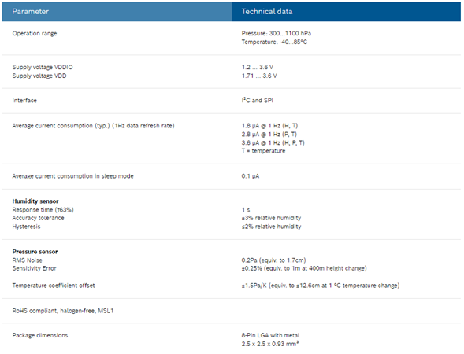
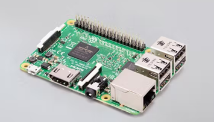

# Workshop 6
#### Cristian Barrera, Manuel Castro

## 1. Identify the basic IoT model

When going to the provided URL to make some tests to the [Rasperry pi simulator](https://azure-samples.github.io/raspberry-pi-web-simulator/#GetStarted) you will see the an image similar as shown below, that mainly contains:

 a. A protoboard (the rectangular white board)
 b. A BME280 sensor (the blue board)
 c. A Raspberry Pi 3 (the green board at the bottom part)
 d. LED diode (the red bulb)
 d. Wires

### The BME280 Sensor

The BME280 sensor was Bosch as an environmental sensor that can capture temperature, humidity and barometric pressure, is recommended for an indoor use, but can be used for controlled outdoor use.

This sensor is a good option when prototyping your projects because of its price and its accuracy, that is 
+- 1°C for temperature, +-1 hPa for barometric pressure and around of +-3% of humidity precision. Even the pressure should change depending on the altitude, the sensor accuracy makes it a good candidate for measuring altitudes as an altimeter if you have the right knowledge about it.

According with [Adafruit](https://www.adafruit.com/product/2652) the BME280 sensor is the Bosch's upgrade of BMP085 and BMP180 sensors. This BMP280 sensor gives you a better performance, accuracy and durability than its predecessors and you can connect it to many platforms to 3.3V or 5V using its own voltage regulator. 
The sensor can be used in both:

**I2C:** The Inter-Integrated Circuit protocol is a simple two wire serial protocol that is used to communicate two chips or devices in an embedded system and has two lines:  
<ul>
<li>SCL, used for clock</li>
<li>SDA, used for data</li></ul>

**SPI:** Serial Peripheral Interface is a four wire serial communication protocol that is based on master-slave architecture. The four lines of SPI are SS, SCL, MISO and MOSI:
<ul>
<li>SS: Slave Select</li>
<li>SCL: Serial Clock used for data communication.</li>

<li>MISO: Master In Slave Out is the master's input data line.</li>
<li>MOSI is the Master Out Slave In is the output data line from the master.</li>
</ul>

In the table below, developed by [Bosch](https://www.bosch-sensortec.com/products/environmental-sensors/humidity-senors-bme280/) you can see more technical details about the sensor.

### The Embedded System

The Raspberry Pi 3 is a board created and supported by the Raspberry foundation and is part of all the Raspberry Pi family that removes the high entry cost to computing for people across all demographics: while children can benefit from a computing education that previously wasn’t open to them, many adults have also historically been priced out of using computers for enterprise, entertainment and creativity. Raspberry Pi eliminates those barriers. Paraphrased  from [Raspberry](https://www.raspberrypi.com/about/).

#### The Software:
The most common operative system for Raspberry is the [Raspberry Pi OS](https://www.raspberrypi.com/software/) which is a linux-based distribution that takes advantage of the kernel execution efficiency. You can also use almost any Linux-based Operative System in Raspberry, but you may experiment different performances, you have to take into account the reasons you purchased the Raspberry, because for IoT you can use a light Linux distribution (even Microsoft Windows IoT Core) or use a robust OS if you want to use as a low cost personal computer. 

#### The Hardware:
This is probably one of the best features that Raspberry could have, because of the versatility and the low cost of the components. As mentioned above, you will need an Operative System for using the board, an you can store it in a SD card with must match some transfer rates requirements but nowadays almost all SD cards can be used to store a Raspberry OS. 

In the first image above, the Raspberry board is a 2015 [Raspberry Pi model 3 B](https://www.raspberrypi.com/products/raspberry-pi-3-model-b/) that is Single-board computer with wireless LAN and Bluetooth connectivity.

This Raspberry board hardware includes:
<ul>
<li>**Quad Core 1.2GHz Broadcom BCM2837 64bit CPU:** probably one of the most significant changes from version 2 to version 3, because even they share the same processor architecture (ARM), the ARM v8  gives more than 45% of velocity improvement compared to the ARM v7 that the Raspberry 2 uses. Find out more info about the processor by clicking [here.](https://datasheets.raspberrypi.com/bcm2836/bcm2836-peripherals.pdf)  </li>
<li>**1GB RAM:** </li>
BCM43438 wireless LAN and Bluetooth Low Energy (BLE) on board
100 Base Ethernet
40-pin extended GPIO
4 USB 2 ports
4 Pole stereo output and composite video port
Full size HDMI
CSI camera port for connecting a Raspberry Pi camera
DSI display port for connecting a Raspberry Pi touchscreen display
Micro SD port for loading your operating system and storing data
Upgraded switched Micro USB power source up to 2.5A

</ul>
