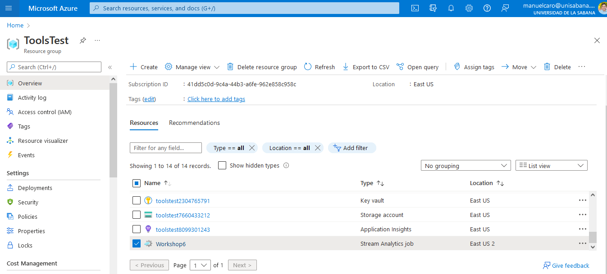

---
output:
  html_document: default
  pdf_document: default
---
# Workshop 6
#### Cristian Barrera, Manuel Castro

## 1. Identify the basic IoT model

When going to the provided URL to make some tests to the [Rasperry pi simulator](https://azure-samples.github.io/raspberry-pi-web-simulator/#GetStarted) you will see the an image similar as shown below, that mainly contains:

 a. A protoboard (the rectangular white board)
 b. A BME280 sensor (the blue board)
 c. A Raspberry Pi 3 (the green board at the bottom part)
 d. LED diode (the red bulb)
 d. Wires

### The BME280 Sensor

The BME280 sensor was Bosch as an environmental sensor that can capture temperature, humidity and barometric pressure, is recommended for an indoor use, but can be used for controlled outdoor use.

This sensor is a good option when prototyping your projects because of its price and its accuracy, that is 
+- 1°C for temperature, +-1 hPa for barometric pressure and around of +-3% of humidity precision. Even the pressure should change depending on the altitude, the sensor accuracy makes it a good candidate for measuring altitudes as an altimeter if you have the right knowledge about it.

According with [Adafruit](https://www.adafruit.com/product/2652) the BME280 sensor is the Bosch's upgrade of BMP085 and BMP180 sensors. This BMP280 sensor gives you a better performance, accuracy and durability than its predecessors and you can connect it to many platforms to 3.3V or 5V using its own voltage regulator. 
The sensor can be used in both:

**I2C:** The Inter-Integrated Circuit protocol is a simple two wire serial protocol that is used to communicate two chips or devices in an embedded system and has two lines:  
<ul>
<li>SCL, used for clock</li>
<li>SDA, used for data</li></ul>

**SPI:** Serial Peripheral Interface is a four wire serial communication protocol that is based on master-slave architecture. The four lines of SPI are SS, SCL, MISO and MOSI:
<ul>
<li>SS: Slave Select</li>
<li>SCL: Serial Clock used for data communication.</li>

<li>MISO: Master In Slave Out is the master's input data line.</li>
<li>MOSI is the Master Out Slave In is the output data line from the master.</li>
</ul>

In the table below, developed by [Bosch](https://www.bosch-sensortec.com/products/environmental-sensors/humidity-senors-bme280/) you can see more technical details about the sensor.

### The Embedded System

The Raspberry Pi 3 is a board created and supported by the Raspberry foundation and is part of all the Raspberry Pi family that removes the high entry cost to computing for people across all demographics: while children can benefit from a computing education that previously wasn’t open to them, many adults have also historically been priced out of using computers for enterprise, entertainment and creativity. Raspberry Pi eliminates those barriers. Paraphrased  from [Raspberry](https://www.raspberrypi.com/about/).

#### The Software:
The most common operative system for Raspberry is the [Raspberry Pi OS](https://www.raspberrypi.com/software/) which is a linux-based distribution that takes advantage of the kernel execution efficiency. You can also use almost any Linux-based Operative System in Raspberry, but you may experiment different performances, you have to take into account the reasons you purchased the Raspberry, because for IoT you can use a light Linux distribution (even Microsoft Windows IoT Core) or use a robust OS if you want to use as a low cost personal computer. 

#### The Hardware:
This is probably one of the best features that Raspberry could have, because of the versatility and the low cost of the components. As mentioned above, you will need an Operative System for using the board, an you can store it in a SD card with must match some transfer rates requirements but nowadays almost all SD cards can be used to store a Raspberry OS. 

In the first image above, the Raspberry board is a 2015 [Raspberry Pi model 3 B](https://www.raspberrypi.com/products/raspberry-pi-3-model-b/) that is Single-board computer with wireless LAN and Bluetooth connectivity.

This Raspberry board hardware includes:
<ul>
<li>**Quad Core 1.2GHz Broadcom BCM2837 64bit CPU:** probably one of the most significant changes from version 2 to version 3, because even they share the same processor architecture (ARM), the ARM v8  gives more than 45% of velocity improvement compared to the ARM v7 that the Raspberry 2 uses. Find out more info about the processor by clicking [here.](https://datasheets.raspberrypi.com/bcm2836/bcm2836-peripherals.pdf)  </li>
<li>**1GB RAM** </li>
<li>**BCM43438 wireless LAN and Bluetooth Low Energy (BLE) on board:**The  Cypress  CYW43438  is  a  highly  integrated  single-chip  solution  and  offers  the  lowest  RBOM  in  the  industry  for  smartphones,tablets, and a wide range of other portable devices. The chip includes a 2.4 GHz WLAN IEEE 802.11 b/g/n MAC/baseband/radio,Bluetooth 4.1 support, and an FM receiver. In addition, it integrates a power amplifier (PA) that meets the output power requirementsof most handheld systems, a low-noise amplifier (LNA) for best-in-class receiver sensitivity, and an internal transmit/receive (iTR) RFswitch, further reducing the overall solution cost and printed circuit board area. Taken from [Cypress](https://pdf1.alldatasheet.com/datasheet-pdf/view/1018493/CYPRESS/BCM43438.html).</li>
<li>**100 Base Ethernet:** Also known as "Fast Ethernet" is one of the current ethernet standard of 100 Mbits/second for twisted pair cable.</li>
<li>**40-pin extended GPIO:** are the pins in the top part of the board in the image, those are the pins where you can connect input and output wires.</li>
<li>**4 USB 2 ports**</li>
<li>**4 Pole stereo output and composite video port:** also known as a audio jack that can also transmit low quality video signals. </li>
<li>**Full size HDMI:** the High Definition Media Interface port for connecting the Raspberry to a monitor, screen or audio system.</li>
<li>**CSI camera port for connecting a Raspberry Pi camera**</li>
<li>**DSI display port for connecting a Raspberry Pi touchscreen display:** this a popular feature among educational institutions that use Raspberry for teaching. The touch interface allows children (and other users) to interact with the interface.</li>
<li>**Micro SD port for loading your operating system and storing data**</li>
<li>**Upgraded switched Micro USB power source up to 2.5A:**  the micro USB connector that many cell phones and smart devices use, you can connect it to a wall outlet or even to a PowerBank. </li>

</ul>

### Connectivity

The Raspberry Pi 3 hardware setting allows you connect to the internet via Wi-fi (wireless - fidelity) or even via Bluetooth (Personal Area Network). The proposed excercise developed in Azure Raspberry simulator uses NodeJS (JavaScript) for capturing the data from the sensors, send it to the Azure IoT hub and to turn on or off the Led diode to indicate in the message status.

#### Physical and Communication Protocols

The physical connection is made by using wires, the protoboard and the GPIO pins. When reviewing the code, you will see that they assign the Pin 4 to the led, and when connecting the sensor, it is set to use the default I2C pins that are the third and fifth one respectively (taking into account the figure below).  
Note that the other connections like voltage in or GND do not affect the code.

**Note: ** for real life implementation the led should be connected with a resistor.

   

#### App Protocol

In the line number 7 of the code,  is communication protocol MQTT is defined for sharing information from the Raspberry to the cloud, in this case Azure. The communication between the sensor and the Raspberry is done by using the I2C protocol previously described.

**MQTT:** this protocol is known as the standard for IoT messaging, according with its [webpage](https://mqtt.org/) is designed as an extremely lightweight publish/subscribe messaging transport that is ideal when connecting remote devices with a minimal network bandwidth. Some of its features include bi-directional communications, the efficiency itself, the scalabilty, the reliability (quality of service levels) and the security (uses TLS and client authentication). 
The image below shows the MQTT Publish/ subscribe Architecture.

### Data Analytics

The Raspberry simulator provided by Microsoft allows us to connect our IoT device to Azure, specifically to Azure IoT hub. The Azure IoT hub is a managed service hosted in the cloud that act as a central node for messaging communications between an IoT application and its devices. 

In the code provided by Microsoft for this simulation, the variables that will be send to the IoT hub are the sensor temperature in Celsius degrees and the percentage of relative humidity, in addition, the program sends the device ID, the message Id and the current time stamp (the date and hour when the message was generated), all well packed in a JSON format that will be sent via Mqtt to Azure IoT hub and can be analysed using some other tools as you will appreciate below.

## 2. Simulate the IoT solution

In this step, we will implement the IoT solution by simulating the Raspberry Requests and making a pretty simple analysis about the data we obtain. This poitn will be a technical approach to what we made and maybe solve some doubts you may have about this process (and how we faced it and solve it).

The first thing you have to do is follow the Raspberry [simulator link](https://azure-samples.github.io/raspberry-pi-web-simulator/#GetStarted) to access the virtual workshop simulator, then you may go to [this link](https://docs.microsoft.com/en-us/azure/iot-hub/iot-hub-raspberry-pi-web-simulator-get-started) to follow the step by step process to configure your environment.

Before clicking the "Start" button in the simulator you should:

1. Create an IoT hub in Azure, here I created this one into a resource group for an easy resource management and it helps you with billing scopes and cross platform integrations.

  

2. Once you created your IoT hub, you must create a device by clicking in the "Device" button in the left menu, and then click in your device and copy the "Primary Connection String" and paste in the connection String variable in your Raspberry Simulator.

  

3. After you click the "Start" button you will see an image like the shown below. but surely you are thinking that the data you are receiving (the one that is being displayed) is being stored somewhere in the IoT hub, but not, it is not stored, the hub just helps you as a node for connecting your IoT devices, for storing the data you will need a database o datalake, in this case we will use a SQL database provided by Azure.

  

4. Again, go to your group of resources and create a new SQL database resource, for this case we uses a single server one without auto-scaling (for billing purposes) and as an extra tip, you can create the database in the same horary zone and server zone where your IoT hub is deployed (for billing purposes too).
In this step, is fundamental to know the server name, the username and the password you set before. It is mandatory to configure the firewall rules to allow you and the azure server itself to access de database by adding your IP and Azure's one, for getting and setting your data.

  

5. Finally, you will need to create the Stream Analytics Job that will serve as the connection between your IoT device and the Database, actually you can insert the data directly from the NodeJS app, but here we do not have full access to the running environment. In this part, you should create a query to retrieve data from and upload it to a your database, so you must create an input that will be your IoT hub, and an output that will be your database, remember the database server and user name? well, for the output configuration you will need it and run the job.

**Note:** you may need to create the table where the data will be stored, use a simple create SQL command to do it, in our case we used **create  table Temperature ( messageId int, deviceId varchar (100), temperature REAL, humidity REAL);**

**Extra tip:** you can use DBeaver for an easier database administration, but embedded Azure query editor is good.

  

And that's all! Now you can use the data that is being generated by your IoT device 

  

### Data Analysis

Once you have the data, you can analyse it, in this case we used Microsoft PowerBI for crating a simple real-time dashboard of our IoT device. The connection is pretty simple: 
1. Click on the "Get data" from the top menu
2. Type "Azure SQL Database" option and click on "connect"
3. Enter your database host name (the same of your Stream Job Output) and click "accept", then you should enter your credentials. 
**Note:** In this step you will have two options for data usage, the "Import" option is better than "Direct Query" one if you need to do some calculations or manipulate some data.

  

You can create the dashboard in the way you want for example we created this one: 

  

You can access the dashboard by [clicking here](https://app.powerbi.com/links/TOKAqxRSYu?ctid=aca51631-00fe-490d-91ab-163ef87260ee&pbi_source=linkShare), but it is probably that you will see an empty document due to the server's current IP (where you are reading this report) is not added in the SQL firewall rules.

There is not much to say about the data, as you can see there is not a pattern over the data, and this is mainly because the simulated sensor generates random data (humidity and temperature) because in a virtual space it can not measure real life changes. The main purpose of this dashboard (and the workshop in general) is that you can use tools like the Microsoft environment to deploy and collect data from your IoT devices in a scalable and "cheap" way, or at leas for prototyping purposes. 

<iframe title="Analytics - Página 1" width="600" height="373.5" src="https://app.powerbi.com/view?r=eyJrIjoiMzJhMGQ0NWMtNzY5NC00MDk5LWIwOWItMTM0ZGVkZDQ4MDRmIiwidCI6ImFjYTUxNjMxLTAwZmUtNDkwZC05MWFiLTE2M2VmODcyNjBlZSIsImMiOjR9" frameborder="0" allowFullScreen="true"></iframe>

